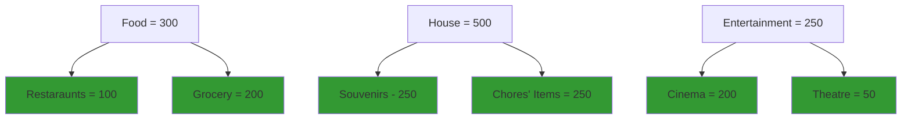
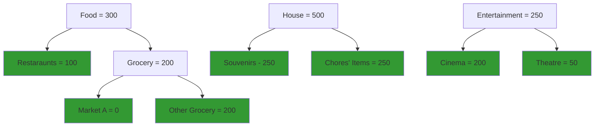

```mermaid
  graph TD;
      F[Food = 300] --> R[Restaraunts = 100];
      F --> G[Grocery = 200];
      H[House = 500] --> S[Souvenirs - 250];
      H --> C[Chores' Items = 250]
      E[Entertainment = 250] --> CI[Cinema = 200];
      E --> T[Theatre = 50]

style R fill:#339933
style G fill:#339933
style S fill:#339933
style C fill:#339933
style CI fill:#339933
style T fill:#339933
```

Then new sub-category added to `Grocery` one (it's no longer terminated).

```mermaid
  graph TD;
      F[Food = 300] --> R[Restaraunts = 100];
      F --> G[Grocery = 200];
      G --> MA[Market A = 0];
      G --> OG[Other Grocery = 200]
      H[House = 500] --> S[Souvenirs - 250];
      H --> C[Chores' Items = 250]
      E[Entertainment = 250] --> CI[Cinema = 200];
      E --> T[Theatre = 50]

style R fill:#339933
style MA fill:#339933
style OG fill:#339933
style S fill:#339933
style C fill:#339933
style CI fill:#339933
style T fill:#339933
```
